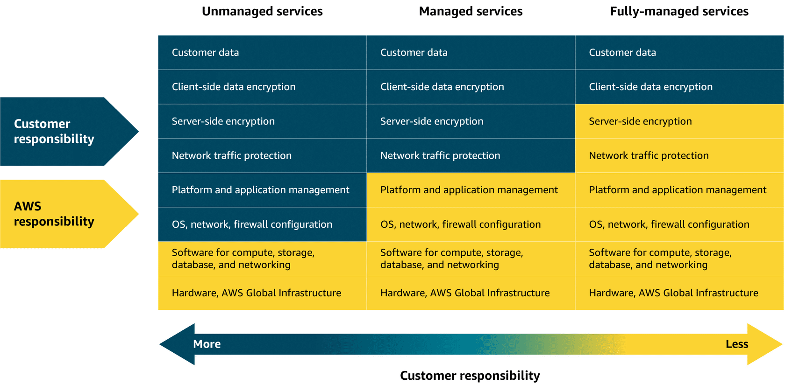

AWS Lambda - function as a service - Lambda is a serverless compute service that runs code in response to events without the need to provision or manage servers. You are charged only for the compute time consumed, down to the millisecond. Lambda handles execution, scaling, and resource allocation.

---

**Amazon Elastic Container Registry (ECR)**

Amazon ECR is a fully managed container registry service that stores, manages, and versions container images. It integrates with other AWS services and provides secure, scalable storage for Docker and OCI images. ECR supports image lifecycle policies for automatic cleanup and uses image scanning to identify vulnerabilities.

**Amazon ECS and Amazon EKS**

Amazon Elastic Container Service (ECS) and Amazon Elastic Kubernetes Service (EKS) are container orchestration services. ECS is AWS's proprietary orchestration platform that simplifies deploying and managing containers at scale. EKS runs Kubernetes, the popular open-source orchestration system, on AWS infrastructure. Both services handle deployment, scaling, load balancing, and managing containerized applications across clusters.

**AWS Fargate**

AWS Fargate is a serverless compute engine for containers that works with both ECS and EKS. It eliminates the need to provision, configure, or manage servers—you simply define your application requirements, and Fargate handles the underlying infrastructure. This allows you to focus on building applications rather than managing compute resources.

---

**Elastic Beanstalk**

AWS Elastic Beanstalk is a Platform as a Service (PaaS) that simplifies application deployment and management. You upload your code, and Beanstalk automatically handles deployment, capacity provisioning, load balancing, auto-scaling, and health monitoring. It supports multiple programming languages and frameworks, allowing developers to focus on writing code rather than managing infrastructure.

**Elastic Oopswork:**

AWS OpsWorks is a [configuration management](https://www.google.com/search?client=firefox-b-d&q=configuration+management&mstk=AUtExfDMssJmD3POLk0rRqdblic5MtYkwTDtUFCcoO5nrn6BJMKXTWwhiSXtAu6NNn2pOAio9l_oAicK5mgP_ajGfWGQWptEMn07KHMW6hv-aT2uoKK-UqMI0Mm91sGnMy7wfWMRKvNgNPc5isngON--M30ar7G3lHXBaGQyHHZ1B2IKMsMLrX6VnyJFj0-MkN8-LSupSOvjbWPhkxW0Rz1VNvzus9fSrRMvQfb7wJxfsVwjt-QeqHM6uyS3Ar8N5qQDhJYIysvaI3ERWjFVZJaikXij&csui=3&ved=2ahUKEwjS9uSa5aqSAxUHSGcHHYNNNzQQgK4QegYIAQgAEAY) service that automates managing [AWS resources](https://www.google.com/search?client=firefox-b-d&q=AWS+resources&mstk=AUtExfDMssJmD3POLk0rRqdblic5MtYkwTDtUFCcoO5nrn6BJMKXTWwhiSXtAu6NNn2pOAio9l_oAicK5mgP_ajGfWGQWptEMn07KHMW6hv-aT2uoKK-UqMI0Mm91sGnMy7wfWMRKvNgNPc5isngON--M30ar7G3lHXBaGQyHHZ1B2IKMsMLrX6VnyJFj0-MkN8-LSupSOvjbWPhkxW0Rz1VNvzus9fSrRMvQfb7wJxfsVwjt-QeqHM6uyS3Ar8N5qQDhJYIysvaI3ERWjFVZJaikXij&csui=3&ved=2ahUKEwjS9uSa5aqSAxUHSGcHHYNNNzQQgK4QegYIAQgAEAc) and applications, using tools like Chef or Puppet to define, deploy, and manage application stacks across their lifecycle (provisioning, configuration, deployment, monitoring). It offers high automation for tasks like software installation, updates, and scaling, letting you define application architecture in "stacks" and "layers" for dynamic, [DevOps](https://www.google.com/search?client=firefox-b-d&q=DevOps&mstk=AUtExfDMssJmD3POLk0rRqdblic5MtYkwTDtUFCcoO5nrn6BJMKXTWwhiSXtAu6NNn2pOAio9l_oAicK5mgP_ajGfWGQWptEMn07KHMW6hv-aT2uoKK-UqMI0Mm91sGnMy7wfWMRKvNgNPc5isngON--M30ar7G3lHXBaGQyHHZ1B2IKMsMLrX6VnyJFj0-MkN8-LSupSOvjbWPhkxW0Rz1VNvzus9fSrRMvQfb7wJxfsVwjt-QeqHM6uyS3Ar8N5qQDhJYIysvaI3ERWjFVZJaikXij&csui=3&ved=2ahUKEwjS9uSa5aqSAxUHSGcHHYNNNzQQgK4QegYIAQgAEAg)-friendly management

**AWS Batch**

AWS Batch is a fully managed service for running batch computing workloads at scale. It automatically provisions the optimal quantity and type of compute resources based on the volume and requirements of submitted jobs. Batch dynamically schedules, queues, and executes jobs across AWS compute services, making it ideal for processing large volumes of data or running parallel workloads.

**Lightsail**

Amazon Lightsail is a simplified compute service designed for users who need straightforward virtual private servers. It offers an easy-to-use interface with pre-configured plans that include compute, storage, and networking at a predictable **low monthly pric**e. **Lightsail is ideal for simple web applications,** websites, development environments, and small-scale projects where ease of use is prioritized over complex configurations.

**Outposts**

AWS Outposts brings AWS infrastructure, services, and tools to your on-premises data center or co-location facility. It provides a fully managed service that extends AWS's cloud capabilities to your local environment, enabling a hybrid cloud architecture. Outposts is useful for workloads that require low latency, local data processing, or compliance with data residency requirements.