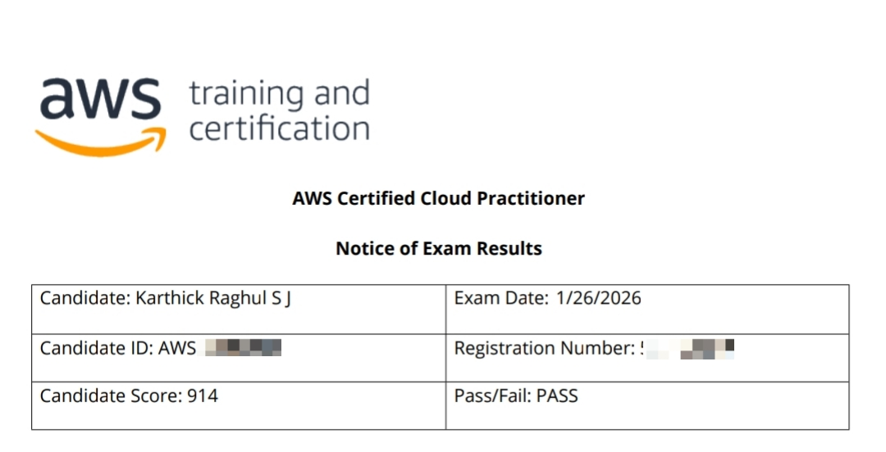

# Struggling for AWS Cloud Practitioner Notes ? Dont know Where to find the practise resources ? Then you'll Find these repository helpful !

*Good Luck with the AWS Cloud Practitioner Certification Exam!*

> **My Experience**:
>   
> I got a score of 914 by learning through AWS SkillBuilder's **AWS Cloud Practitioner Essentials** , Took Notes , learned from them and finally took practice tests before writing the original exam. Practiced Strongly for two days before exam .  Some of the questions were direct questions and some scenario based questions .My exam had questions about **AWS CAF** (Which I felt a bit confusing 🫩) . Around 10-12 questions repeated from the mock test that I took . I never paid anything for the Practice exams and the test I provided below are also free .

---

## My Personal Notes :

- [Module 1 - Introduction to Cloud](Module%201%20-%20Introduction%20to%20Cloud)  
- [Module 2 - Computing in the cloud](Module%202%20-%20Computing%20in%20the%20cloud)  
- [Module 3 - Exploring Compute Services](Module%203%20-%20Exploring%20Compute%20Services)  
- [Module 4 - Going Global](Module%204%20-%20Going%20Global)  
- [Module 5 - Networking](Module%205%20-%20Networking)   
- [Module 6- Storage](Module%206-%20Storage)  
- [Module 7- Databases](Module%207-%20Databases)  
- [Module 8- AI-ML and Data Analytics](Module%208-%20AI-ML%20and%20Data%20Analytics)  
- [Module 9- Security](Module%209-%20Security)  
- [Module 10- Introduction to Monitoring, Compliance, and Governance](Module%2010-%20Introduction%20to%20Monitoring,%20Compliance,%20and%20Governance)  
- [Module 11- Pricing and Support](Module%2011-%20Pricing%20and%20Support)  
- [Module 12- Migrating to the AWS Cloud](Module%2012-%20Migrating%20to%20the%20AWS%20Cloud)  
- [Module 13- Well-Architected Solutions](Module%2013-%20Well-Architected%20Solutions)  
- [Overall Revision](Overall%20Revision)  

  ---
  
Practise Exam Resources :

 1. Playlist of CloudGuru - [https://youtube.com/playlist?list=PL_0RK_1F4sTDNZOzu4aQ0h7RBA6tPwuUj&si=dfO1JtwVOv4Xd6c-](https://youtube.com/playlist?list=PL_0RK_1F4sTDNZOzu4aQ0h7RBA6tPwuUj&si=dfO1JtwVOv4Xd6c-)
2. More than 1000 practise questions: [https://github.com/kananinirav/AWS-Certified-Cloud-Practitioner-Notes/tree/master/practice-exam](https://github.com/kananinirav/AWS-Certified-Cloud-Practitioner-Notes/tree/master/practice-exam)
3. Mock tests : [https://www.awsboy.com/aws-practice-exams/practitioner](https://youtube.com/playlist?list=PL_0RK_1F4sTDNZOzu4aQ0h7RBA6tPwuUj&si=dfO1JtwVOv4Xd6c-)

  